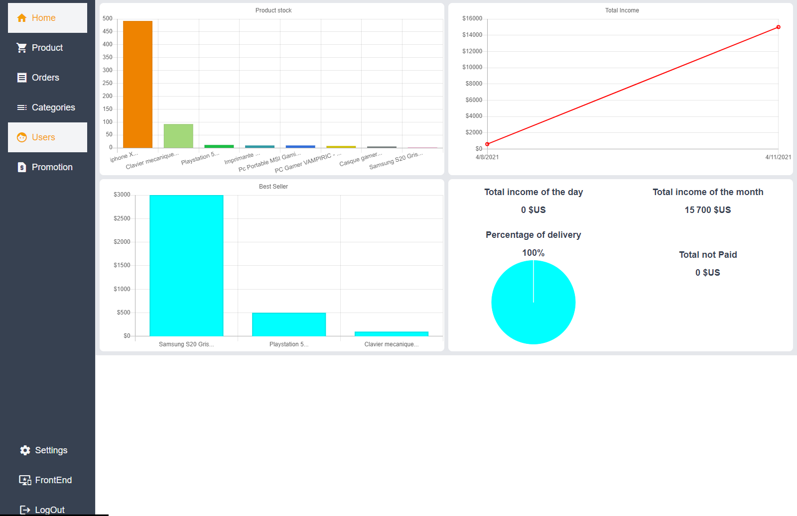

# eShop-Amazon Clone

An Amazon Clone eShop, created with VueJs 3, TailwindCss and Firebase.

## General info

This project is a full eShop App with both frontend and backend designed and developed from scratch.

## Technologies

Project is created with:

-   VueJs 3, composition API
-   Tailwindcss
-   Firebase
-   Algolia
-   chart.js

## Installation
- Create a firebase account https://firebase.google.com/
- Create an algolia acount https://www.algolia.com/
- Rename the .envSample by .env and fill it with your firbase and algolia credentials
- npm install

## Info

All the product in the app are fake and just for example, if you do a precess order you will not be chrged ;)
